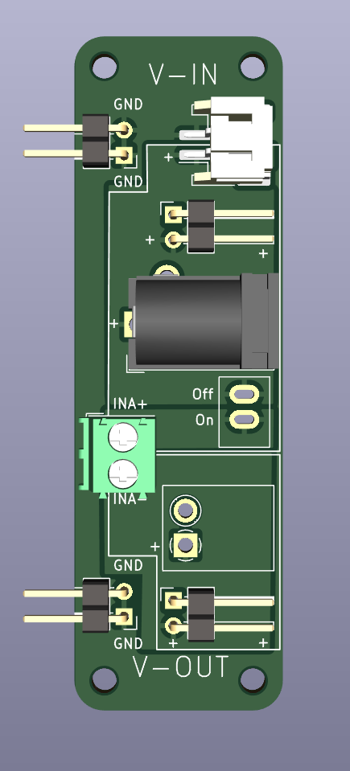
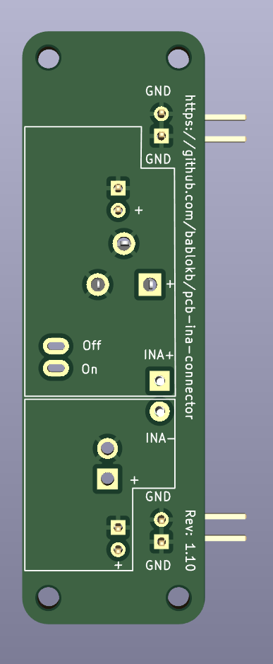

PCB INA-Connector
=================

This is a support PCB for Adafruit's INA219, INA260 and INA3221
breakouts. Connect the power-source to one of the connectors
on the V-IN side, the load to one of the connectors on the V-OUT
side and the INA-breakout to the screwterminal on the back.

V-IN supports

  - a JST-PH2 connector (typically for a LiPo) or
  - a two-pin DuPont 2.54mm pitch header or
  - a 5.5/2.1mm barrel jack

V-OUT suports

  - an AKL-182 socket or
  - a two-pin DuPont 2.54mm pitch header
    
The AKL-182 socket takes AKL-169 plugs. I use these with various
adapter wires, equiped e.g. with micro-USB, USB-C, JST-PH2 on the
other end.
As an alternative, you could use plain 3.5mm screw-terminals.

The footprint inbetween V-IN and V-OUT is for a mini toggle
switch, e.g.
<https://aliexpress.com/item/1005004692981776.html>.

You should also connect GND of this PCB to the INA-breakout if it
does not share GND somewhere else. Likewise for the INA3221
(which has three channels), use and connect three of these
PCBs.

Schematic
---------

Layout
------

3D-Views
--------

License
-------

[![CC BY-SA 4.0][cc-by-sa-shield]][cc-by-sa]

This work is licensed under a
[Creative Commons Attribution-ShareAlike 4.0 International
License][cc-by-sa].

[![CC BY-SA 4.0][cc-by-sa-image]][cc-by-sa]

[cc-by-sa]: http://creativecommons.org/licenses/by-sa/4.0/
[cc-by-sa-image]: https://licensebuttons.net/l/by-sa/4.0/88x31.png
[cc-by-sa-shield]:
https://img.shields.io/badge/License-CC%20BY--SA%204.0-lightgrey.svg
